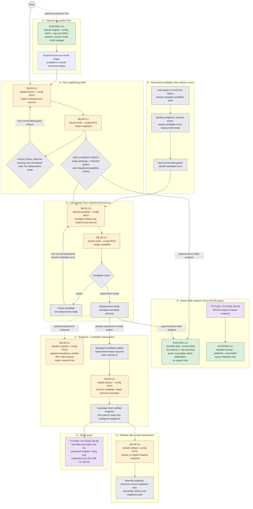

# Database operator journeys — refresh, stage, snapshot, replace, rollback, proof

> **Decision support only.** Not settled authority; not implementation authorization. Amber
> boxes show the implemented DB-08 commands and their safety ordering.

## Legend

| Style | Meaning |
|---|---|
| Green | **EXISTING CLI** — supported command delivered by DB-01..DB-07 |
| Amber | **DB-08 CLI** — implemented package-owned rebuild command |
| Purple | **FUTURE / OUTSIDE DB-08** |
| Grey | Scenario steps, outcomes, or decision points (not commands) |

The companion page [`database-toolchain.md`](database-toolchain.md) shows the full data flow
behind these journeys, including the untouched old database.

## Journeys

## What each journey shows

- **A — First neighboring build.** `rebuild refresh` creates or opens the v1 neighbor, consumes
  explicit retained local opening and game sources, and runs the shared verifier. An opening-only
  result is a valid structural partial checkpoint; replacement-ready additionally requires imported
  games and all verifier checks. Initial creation is the same idempotent tooling as later refreshes.
- **B — Later local update.** `rebuild candidate` refreshes only the managed sibling candidate and
  verifies it without touching the working neighbor. Satisfied work is skipped and incomplete work
  is resumed by the next ordinary invocation. `rebuild verify --config PATH --target candidate`
  distinguishes partial from ready.
- **C — Optional acquisition.** Network acquisition stays an explicit, separate operator step.
  `games acquire` publishes retained raw months; `rebuild refresh` and `rebuild candidate` consume
  those local files and never acquire from the network.
- **D — Optional Stockfish population.** `stockfish bulk --preset initial` selects 20 common plus
  five fixed technical positions, runs serially, resumes eligible work, and publishes directly with
  no queue rows. The worker is a separate path for API-03 queue requests only.
- **E — Interruption and recovery.** An interrupted or crash-like managed candidate remains isolated
  from the usable neighbor and is not replacement-ready. The next normal `rebuild candidate` rerun
  resumes or reconstructs it; there is no recover command or permanent run/failure record.
- **F — Snapshot plus candidate replacement.** `rebuild snapshot` uses a verified WAL-safe SQLite
  backup and retains the newest three. `rebuild replace` verifies the managed candidate, obtains the
  exclusive Windows mutation boundary, automatically takes a fresh verified snapshot, then atomically
  swaps only the configured neighbor. The old database and application cutover are never involved.
- **G — Rollback.** `rebuild rollback` re-verifies the newest or selected retained snapshot, preserves
  the current neighbor first, and atomically restores only the neighbor path. This is distinct from
  RETIRE-01's separate old-database restore path; the old database is never involved.
- **H — DB-09 proof.** Real rebuilt data proves the foundation using only supported commands
  from DB-01..DB-08. Cutover (CUT-01) remains outside DB-08 entirely.

## Evidence notes

- DB-08 envelope: `docs/master-plans/database-rebuild/database-rebuild.md`, slice "DB-08 —
  Rebuild, snapshot, and replacement operations" (visible result, scope, exclusions, focused
  proof, escalate-if).
- Idempotence, resumability, snapshot, and rollback authority:
  `docs/grilling-docs/database-rebuild-direction.md` sections 2.3-2.5.
- Existing commands and their proven failure/interruption behavior: focused Plans under
  `docs/plans/done/database-rebuild-db-01/` through `.../database-rebuild-db-07/`.
