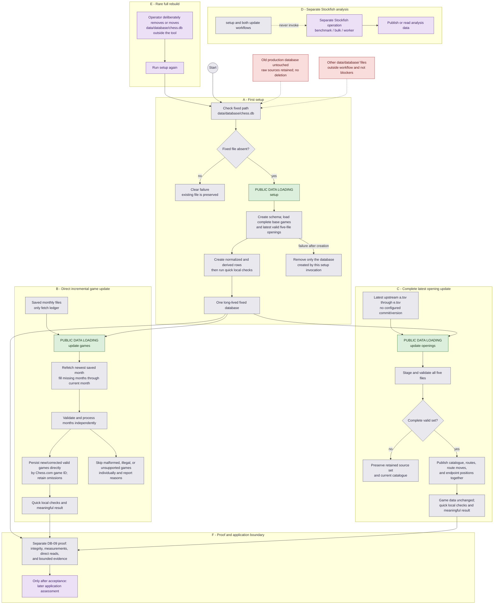

# Database operator journeys — direct setup and updates

> **Decision support only.** These journeys show the confirmed current DB-09 lifecycle. The
> historical DB-08/DB-08A database-file operations are not supported current journeys.

The companion page [`database-toolchain.md`](database-toolchain.md) shows the internal data flow
and retained boundaries. The durable command inventory is
[`database-command-inventory.md`](database-command-inventory.md).

## Journeys

## What each journey shows

- **A — First setup.** `setup` uses only the exact fixed destination and refuses to touch a
  pre-existing file. It composes schema creation, complete base game loading, latest valid
  opening loading, and derived-row creation. A later failure removes only the newly created
  database; there is no resume or recovery protocol.
- **B — Games.** Saved monthly files remain the only fetch ledger. The newest saved month is
  refetched, missing months are filled, corrected games replace their saved representation by
  Chess.com ID, new games are added, omitted games remain, and successfully completed months
  remain usable if a later month fails.
- **C — Openings.** All five latest opening files are staged and validated before publication.
  An invalid set leaves both retained sources and the current catalogue in place. A valid set
  publishes the complete catalogue and routes without changing game data.
- **D — Stockfish.** Analysis is a separate operation. Setup and updates do not run the engine;
  internal analysis services do not turn Stockfish into a fourth data-loading workflow.
- **E — Rare rebuild.** A full rebuild is deliberately initiated by the operator outside the
  tool by removing or moving the fixed database, followed by `setup`. There is no supported
  reset, rebuild, snapshot, replacement, rollback, recovery, or separate verification command.
- **F — Proof and application.** Normal operations use quick local checks only. Full DB-09
  proof is separate, and backend/frontend/API application work remains behind the pre-application
  gate until DB-09 is accepted.

The old production database, retained raw sources (with only the approved current-month
refetch/merge), approved schema, legacy scripts, and unrelated files under `data/database/`
remain explicit boundaries. This document does not create a database,
authorize implementation, or rewrite completed DB-08/DB-08A Plans or prior grilling records.

## Evidence notes

- Current behavioral authority: `docs/grilling-docs/database-rebuild-simple-lifecycle.md`.
- Current Plan: `docs/plans/active/database-rebuild-db-09/database-rebuild-db-09.md`.
- The historical DB-08/DB-08A records remain preserved and are not current command authority.
