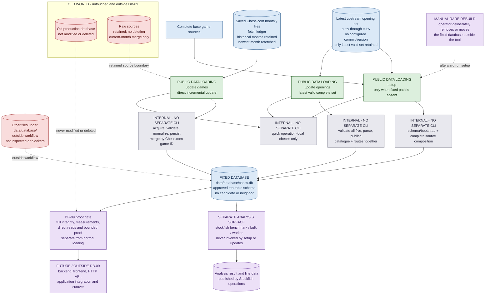

# Database toolchain — current DB-09 direct lifecycle

> **Decision support only.** This diagram records the confirmed current DB-09 direction; it is
> not implementation authorization. Historical DB-08/DB-08A database-file machinery is not a
> supported part of this lifecycle.

The durable command inventory is tracked in
[`database-command-inventory.md`](database-command-inventory.md).

## Legend

| Style | Meaning | Examples |
|---|---|---|
| Green | **PUBLIC DATA LOADING** — exactly the three supported data-loading workflows | `setup`, `update games`, `update openings` |
| Grey | **INTERNAL — NO SEPARATE DATA-LOADING CLI** — package service composed by a public workflow | validation, normalization, persistence |
| Purple | **SEPARATE / OUTSIDE THE DATA-LOADING LIFECYCLE** | Stockfish analysis, later application work |
| Blue | **Retained data artifact** | monthly source files, five opening files, fixed database |
| Red | **Boundary** — retained or explicitly outside scope | old database, other `data/database/` files |

## Flow

## How to read the flow

- **Exactly three public data-loading workflows.** `setup`, `update games`, and `update
  openings` are the only public end-to-end data-loading operations. Fetching and persistence
  are composed internally; separate fetch/import commands are not supported.
- **Fixed destination.** Every workflow writes only to `data/database/chess.db`. Setup refuses
  a pre-existing file. If a failed setup created the file, cleanup removes only that new file;
  it never replaces an existing database or deletes sources.
- **Games.** The saved monthly files are the only fetch ledger. The newest saved month is
  refetched, missing months are filled through the current month, and valid new or corrected
  games are persisted directly. Omitted games remain, invalid games are skipped individually,
  and month progress is independent.
- **Openings.** The latest upstream `a.tsv` through `e.tsv` set is obtained without a configured
  commit/version input and validated completely before publication. A bad or incomplete set
  leaves the retained source set and catalogue intact; a valid set publishes the catalogue and
  routes together without changing game data.
- **Quick checks and Stockfish.** Normal setup and updates run only quick local checks. Full
  proof routines and measurements are separate. Stockfish analysis is a separate surface and
  is never run as part of setup or either update.
- **Manual rare rebuild.** A full rebuild is an operator action outside the tool: deliberately
  remove or move the fixed database, then run `setup`. There is no reset, rebuild, resume,
  recovery, snapshot, rollback, replacement, or verification command for this lifecycle.
- **Boundaries.** The old production database remains untouched. Raw sources are retained with
  only the approved current-month refetch/merge; no raw source is deleted. The approved schema
  is not expanded, legacy scripts are noncanonical evidence only, and other files under
  `data/database/` are outside the workflow. No application consumer is integrated before the
  DB-09 gate is accepted.

The diagram does not create a database, authorize implementation or application work, or
rewrite completed DB-08/DB-08A Plans or prior grilling records.

## Evidence notes

- Current behavioral authority: `docs/grilling-docs/database-rebuild-simple-lifecycle.md`.
- Current lifecycle and boundaries: `docs/plans/active/database-rebuild-db-09/database-rebuild-db-09.md`.
- Current command inventory: [`database-command-inventory.md`](database-command-inventory.md).
- Historical DB-08/DB-08A records remain available as historical evidence only.
