# Database toolchain after DB-08, with DB-09 handoff

> **Decision support only.** Not settled authority; not implementation authorization. The DB-08
> boxes below record the implemented package-owned command surface and its safety boundaries.

The durable DB-09 command surface is tracked in
[`database-command-inventory.md`](database-command-inventory.md).

## Legend

| Style | Meaning | Examples |
|---|---|---|
| Green | **EXISTING CLI** — supported command delivered and proven by DB-01..DB-07 | `games import`, `stockfish bulk` |
| Amber | **DB-08 CLI** — implemented package-owned rebuild operation | `rebuild refresh`, `rebuild replace` |
| Grey | **INTERNAL — NO CLI NEEDED** — package-internal service; not operator-facing | canonicalization, queue claims |
| Purple | **FUTURE / OUTSIDE DB-08** | viewer enqueue (API-03), DB-09, CUT-01 |
| Blue | **Data artifact** — raw files, database tables, snapshot files, benchmark artifacts | raw month ledger, snapshot files |
| Red | **Old database** — never modified, snapshotted, replaced, or deleted by DB-08 | `chess_games.db` |

## Flow

```mermaid
flowchart TD
    %% ===== sources and retained raw data =====
    CC["Chess.com API<br/>archive + month responses"]
    LICHESS["Fixed Lichess GitHub repository<br/>one resolved commit"]
    TSV["Five opening TSV files<br/>a.tsv .. e.tsv, local"]
    CFG["YAML config<br/>username + trainer UUID"]
    RCFG["DB-08 YAML config<br/>rebuilt_neighbour: PATH"]

    subgraph OLD["OLD WORLD - never touched by DB-01..DB-08"]
        OLDDB[("Old chess_games.db<br/>5.8 GB, WAL mode,<br/>-shm and -wal sidecars")]
    end

    RAWF[("Raw month ledger<br/>data/chess-com/raw/games/YYYY/MM.json<br/>historical months immutable,<br/>current month UUID-merged")]

    %% ===== existing supported CLIs =====
    ACQ["EXISTING CLI<br/>games acquire<br/>--config PATH --raw-root PATH"]
    IMP["EXISTING CLI<br/>games import<br/>--config PATH --raw-root PATH<br/>--database PATH"]
    OACQ["EXISTING CLI<br/>openings acquire<br/>--source-dir PATH<br/>fixed commit, five files"]
    SCHEMA["EXISTING CLI<br/>schema create --database PATH"]
    INSPECT["EXISTING CLI<br/>schema inspect --database PATH"]
    OIMP["EXISTING CLI<br/>openings import<br/>--source-dir PATH --database PATH"]
    OLOOK["EXISTING CLI<br/>openings lookup --database --fen<br/>openings replay --database --pgn-file"]
    PM["EXISTING CLI<br/>preferred-moves list / resolve / set / unset"]
    BENCH["EXISTING CLI<br/>stockfish benchmark<br/>explicit executable, input,<br/>output, matrix arguments"]
    BULK["EXISTING CLI<br/>stockfish bulk --preset initial<br/>--database --executable<br/>serial, resumable, direct"]
    WORKER["EXISTING CLI<br/>stockfish worker<br/>--database --executable<br/>API-03 queue requests only"]

    %% ===== internal package services =====
    NORM["INTERNAL - NO CLI NEEDED<br/>pure normalization + PGN replay<br/>games/normalization.py"]
    CANON["INTERNAL - NO CLI NEEDED<br/>canonical legal-only position identity<br/>positions/"]
    OPARSE["INTERNAL - NO CLI NEEDED<br/>strict five-file parse, legal replay,<br/>semantic dedupe - openings/source.py"]
    OPUB["INTERNAL - NO CLI NEEDED<br/>child-first atomic catalogue replace<br/>openings/persistence.py"]
    TSEL["INTERNAL - NO CLI NEEDED<br/>initial selector: 20 common +<br/>five fixed technical positions<br/>stockfish/targets.py"]
    QOPS["INTERNAL - NO CLI NEEDED<br/>claim, stale reclaim, promotion<br/>stockfish/queue.py"]
    PUB["INTERNAL - NO CLI NEEDED<br/>atomic result + line publication<br/>analysis/repository.py"]
    MUTEX["INTERNAL - NO CLI NEEDED<br/>Windows named mutex per database path<br/>stockfish/mutex.py"]

    %% ===== neighbor database artifacts =====
    subgraph NB["NEIGHBOR DATABASE - schema v1, ten tables, user_version = 1"]
        T1[("datasource_game<br/>derived_game_position<br/>derived_position")]
        T2[("datasource_opening<br/>derived_opening_route<br/>derived_opening_route_move<br/>+ endpoint positions in derived_position")]
        QUEUE[("derived_analysis_queue")]
        T3[("datasource_preferred_move_period")]
        T4[("derived_analysis_result<br/>derived_analysis_line")]
    end

    BART[("Benchmark artifacts<br/>JSONL + summaries in output dir,<br/>no database writes")]

    %% ===== DB-08 operations layer =====
    subgraph OPS["DB-08 OPERATIONS LAYER - implemented commands"]
        REFRESH["DB-08 CLI<br/>rebuild refresh --config PATH<br/>explicit retained local sources"]
        VER["DB-08 CLI<br/>rebuild verify --config PATH<br/>--target neighbour|candidate|snapshot<br/>snapshot target: --snapshot PATH"]
        SNAP["DB-08 CLI<br/>rebuild snapshot --config PATH<br/>verified WAL-safe backup"]
        STAGE["DB-08 CLI<br/>rebuild candidate --config PATH<br/>managed sibling only"]
        REPLACE["DB-08 CLI<br/>rebuild replace --config PATH<br/>reverify, exclusive, atomic swap"]
        ROLLBACK["DB-08 CLI<br/>rebuild rollback --config PATH<br/>retained snapshot, atomic restore"]
        PARTIAL{"STRUCTURAL PARTIAL<br/>opening-only checkpoint;<br/>not replacement-ready"}
        READY{"REPLACEMENT-READY<br/>ready openings + imported games<br/>and shared verifier checks"}
        NEIGHBOR[("Configured rebuilt neighbour<br/>only managed destination")]
        CANDIDATE[("Managed sibling candidate<br/><neighbour>.candidate")]
        SELECTED[("Selected retained snapshot")]
        RREADY["Shared verifier confirms<br/>selected rollback source"]
        PRESERVE["Preserve current neighbour first<br/>fresh verified recovery snapshot"]
        RESTORE["Atomic restore selected snapshot<br/>to configured neighbour"]
        SNAPF[("Verified snapshot files<br/>rolling max three newest,<br/>SQLite backup facility,<br/>never file-copied")]
    end

    %% ===== future / outside =====
    ENQ["FUTURE / OUTSIDE DB-08<br/>API-03 analysis request enqueue"]
    DB09["FUTURE / OUTSIDE DB-08<br/>DB-09 real-data proof gate<br/>over the populated neighbor"]
    CUT["FUTURE / OUTSIDE DB-08<br/>application cutover = CUT-01,<br/>after DB-09 and API slices"]

    %% ===== acquisition and import flow =====
    CFG --> ACQ
    CC --> ACQ
    ACQ -->|"atomic month publish,<br/>failed fetch leaves prior file intact"| RAWF
    RAWF --> IMP
    IMP --> NORM --> CANON
    CANON --> T1

    %% ===== schema =====
    SCHEMA -->|"creates empty v1 target only"| NB
    T1 -.->|"read-only inspection"| INSPECT

    %% ===== openings =====
    LICHESS --> OACQ -->|"validate all five before<br/>staged local publication"| TSV
    TSV --> OIMP --> OPARSE
    OPARSE --> OPUB
    OPUB --> T2
    OPUB --> CANON

    %% ===== preferred moves =====
    PM --> CANON
    PM --> T3

    %% ===== analysis =====
    T1 --> TSEL
    T2 --> TSEL
    TSEL --> CANON
    CANON --> PUB --> T4
    BULK -->|"20 common + five technical;<br/>serial and no queue rows"| MUTEX --> TSEL
    ENQ --> QUEUE
    QUEUE --> QOPS
    QOPS --> PUB
    WORKER --> MUTEX --> QOPS
    BENCH --> BART

    %% ===== DB-08 layer =====
    RCFG --> REFRESH
    REFRESH -->|"reuse local game/opening services;<br/>never acquire from network"| IMP
    REFRESH -->|"opening publication may leave<br/>a valid partial checkpoint"| OIMP
    REFRESH -->|"run after each stage and at end"| VER
    REFRESH -->|"normal rerun resumes satisfied<br/>or incomplete work"| PARTIAL
    VER -->|"opening-only, structurally valid"| PARTIAL
    VER -->|"openings + games and all checks"| READY
    PARTIAL -.->|"next normal idempotent<br/>refresh or candidate rerun"| REFRESH
    STAGE -->|"refresh only this managed sibling"| CANDIDATE
    CANDIDATE -->|"shared verifier"| VER
    READY -->|"candidate verified before mutation"| REPLACE
    SNAP -->|"SQLite backup API, WAL-safe"| SNAPF
    SNAPF -->|"snapshot target input to shared verifier"| VER
    REPLACE -->|"1. reverify candidate + obtain exclusive<br/>Windows boundary;<br/>2. automatic fresh verified snapshot<br/>and retain newest three"| SNAP
    REPLACE -->|"3. atomic swap only configured<br/>neighbour; candidate is isolated"| NEIGHBOR
    ROLLBACK -->|"1. select newest or explicit retained snapshot"| SELECTED
    SNAPF -.->|"retained snapshot choices"| SELECTED
    SELECTED -->|"2. rollback re-verifies source<br/>through shared verifier"| VER
    VER -->|"verified rollback source"| RREADY
    RREADY -->|"3. preserve current neighbour first"| PRESERVE
    PRESERVE -->|"4. fresh verified recovery point;<br/>then atomic restore selected source"| RESTORE
    RESTORE -->|"5. restore only configured neighbour"| NEIGHBOR
    OPS -.->|"operates only on managed<br/>neighbor/candidate files"| NB
    OLDDB -.->|"DB-08 performs NO modification,<br/>snapshot, replacement, or deletion"| OPS
    NB --> DB09
    DB09 -.-> CUT

    %% ===== styling =====
    classDef cli fill:#dcefdd,stroke:#2f6b2f,color:#173315
    classDef cand fill:#fdf0d5,stroke:#a3690a,color:#4a3005
    classDef internal fill:#e8e8ee,stroke:#55556b,color:#26263a
    classDef future fill:#ece0f7,stroke:#6a3a9c,color:#3a2160
    classDef store fill:#dbe9f7,stroke:#28588c,color:#173154
    classDef olddb fill:#f9dcdc,stroke:#9c2b2b,color:#5c1717

    class ACQ,IMP,OACQ,SCHEMA,INSPECT,OIMP,OLOOK,PM,BENCH,BULK,WORKER cli
    class REFRESH,SNAP,VER,STAGE,REPLACE,ROLLBACK cand
    class NORM,CANON,OPARSE,OPUB,TSEL,QOPS,PUB,MUTEX internal
    class PARTIAL,READY,RREADY,PRESERVE,RESTORE internal
    class ENQ,DB09,CUT future
    class RAWF,SNAPF,NEIGHBOR,CANDIDATE,SELECTED,T1,T2,T3,T4,QUEUE,BART store
    class OLDDB olddb
```

## How to read the flow

- **Acquisition vs normalization are distinct.** `games acquire` touches only the raw month
  files and never SQLite; `games import` reads local raw files and writes the database only,
  never the network. `openings acquire` resolves and publishes the local five-file Lichess
  source set; `openings import` reads that local set and writes the database.
- **Everything writes through one canonical identity.** Game occurrences, opening endpoints,
  standalone preference positions, and bulk-analysis route positions all create or reuse the
  same permanent `derived_position` rows.
 - **Bulk vs queue are distinct publication paths.** `stockfish bulk --preset initial` selects 20
   common plus five fixed technical positions, runs serially, and publishes directly without queue
   rows. Queue rows exist only for future API-03 requests and are drained by `stockfish worker`.
   Both paths share the DB-06 atomic result/line publication.
 - **Refresh and acquisition are distinct.** `rebuild refresh` consumes explicit retained local
   opening and raw-game sources and never acquires from the network. `games acquire` remains the
   separate network-facing operator step.
 - **Partial and ready are distinct.** Opening publication can leave a structurally valid
   opening-only checkpoint. The shared verifier reports replacement-ready only after ready openings,
   imported games, and the integrity/compatibility checks pass.
 - **DB-08 operates only on managed neighbor files and snapshots.** Candidate staging is isolated
   beside the configured neighbor; replacement verifies it, takes a fresh verified snapshot, and
   swaps only the neighbor under the exclusive Windows boundary. Rollback re-verifies a retained
   snapshot, preserves the current neighbor first, and restores only that path. The dashed red edge
   records the envelope's exclusion: no old-database modification or application cutover (CUT-01,
   after DB-09). Interrupted candidate work is recovered by the next ordinary idempotent rerun;
   there is no recovery command or permanent run/failure record.

## Evidence notes

- DB-08 envelope and exclusions: `docs/master-plans/database-rebuild/database-rebuild.md`,
  slice "DB-08 — Rebuild, snapshot, and replacement operations" and "Explicit exclusions".
- Snapshot/backup and idempotent-refresh authority:
  `docs/grilling-docs/database-rebuild-direction.md` sections 2.3-2.5 (backup facility, rolling
  max three, initial build = refresh against an empty database, raw month ledger).
- Existing commands and package boundaries: focused Plans under
  `docs/plans/done/database-rebuild-db-01/` through `.../database-rebuild-db-07/`.
- Legacy scripts (for example `scripts/refresh_chess_com.py`) and backend path helpers are
  conceptual evidence only and appear nowhere in this flow as implementation targets.
- The durable DB-09 package command inventory is [`database-command-inventory.md`](database-command-inventory.md).
